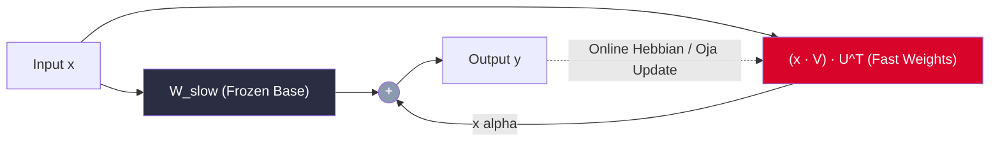

# 🧬 Plastic Transformer: Persistent Fast-Weight Adaptation

[](https://www.python.org/downloads/)
[](https://pytorch.org/)
[](https://opensource.org/licenses/MIT)
[](paper/Plasticity_Is_All_You_Need.pdf)

> **"Plasticity Is All You Need? A Testable Proposal for Persistent Fast-Weight Adaptation"**  
> *Author:* **Thomas Nauheimer** (nauheimer.t@gmail.com) — September 2026

---

## 📌 The Problem: Static Weights & Amnesia

State-of-the-art Large Language Models (LLMs) suffer from a fundamental architectural limitation: **their weights are frozen after pretraining**. 
- In-context learning (RAG, long context windows) is transient: once the context window is cleared, the model experiences **100% amnesia**.
- Fine-tuning (SGD, LoRA) is offline, compute-heavy, and prone to **catastrophic forgetting**.

## 💡 The Solution: Synaptic Fast-Weight Adaptation

**Plastic Transformer** provides dynamic, low-rank synaptic fast weights that participate directly in the forward pass during inference:

$$W_{\text{eff}}(t) = W_{\text{slow}} + \alpha \cdot \left( U(t) V(t)^T \right)$$

- **$W_{\text{slow}}$**: Frozen foundational model weights (preserving base capabilities).
- **$U(t) \in \mathbb{R}^{d_{\text{out}} \times r}, V(t) \in \mathbb{R}^{d_{\text{in}} \times r}$**: Dynamic low-rank fast weights ($r \ll d$).
- **Runtime Adaptation**: Online Hebbian / Oja updates without global backpropagation.
- **Subspace Invariance**: Orthogonal projection $P = I - Q Q^T$ guarantees that protected capabilities in $\text{span}(Q)$ suffer **strictly zero interference** ($\le 10^{-16}$).



---

## 🚀 Quickstart

### 1. Installation

```bash
git clone https://github.com/nauheimer/plastic-transformer.git
cd plastic-transformer
pip install -r requirements.txt
```

### 2. Injecting Plasticity into any PyTorch Model

```python
import torch
from plastic_transformer import PlasticModelWrapper

# Wrap your existing PyTorch or HuggingFace Transformer
model = YourPretrainedTransformer()
plastic_model = PlasticModelWrapper(
    model, 
    target_modules=["q_proj", "v_proj", "o_proj"], 
    rank=8, 
    eta=0.05
)

# Inference forward pass
out = plastic_model(input_tokens)

# Adapt online during conversation (Hebbian synaptic step)
plastic_model.step_plasticity(surprise_signal=1.0)

# Save lightweight episodic memory snapshot (< 5 MB)
plastic_model.save_synaptic_memory("episodic_memory.pt")
```

---

## 🔬 Experimental Verification

Run the included verification suite:

```bash
# 1. Run all unit tests
python -m unittest discover -s tests

# 2. Run interactive Llama/Qwen Transformer demo
python examples/demo_transformer.py

# 3. Run formal projected delta-rule regression benchmark
python examples/demo_projected_adaptation.py
```

### Measured Subspace Invariance Benchmark:

| Seed | Held-out MSE Before | Held-out MSE After | Max Protected Change | Verification Status |
|:---:|:---:|:---:|:---:|:---:|
| **0** | 0.254999 | $2.74 \times 10^{-10}$ | $3.47 \times 10^{-17}$ | 🟢 Exact Invariance |
| **1** | 0.291153 | $3.13 \times 10^{-10}$ | $2.78 \times 10^{-17}$ | 🟢 Exact Invariance |
| **2** | 0.227038 | $2.44 \times 10^{-10}$ | $2.78 \times 10^{-17}$ | 🟢 Exact Invariance |
| **3** | 0.413457 | $4.44 \times 10^{-10}$ | $9.02 \times 10^{-17}$ | 🟢 Exact Invariance |
| **4** | 0.501408 | $5.38 \times 10^{-10}$ | $3.47 \times 10^{-17}$ | 🟢 Exact Invariance |

*Base weights remain bit-identical across all trials.*

---

## 📄 Research Paper

The formal research paper is available in the `paper/` directory:
- Markdown draft: [`paper/Plasticity_Is_All_You_Need.md`](paper/Plasticity_Is_All_You_Need.md)
- Compiled publication PDF: [`paper/Plasticity_Is_All_You_Need.pdf`](paper/Plasticity_Is_All_You_Need.pdf)

To recompile the PDF at any time:
```bash
python paper/generate_paper_pdf.py
```

---

## 📚 Citation

If you use this work in your research, please cite:

```bibtex
@misc{nauheimer2026plasticity,
  author       = {Thomas Nauheimer},
  title        = {Plasticity Is All You Need? A Testable Proposal for Persistent Fast-Weight Adaptation in Neural Architectures},
  year         = {2026},
  month        = {September},
  howpublished = {\url{https://github.com/nauheimer/plastic-transformer}},
  note         = {Preprint}
}
```

---

## ⚖️ License

Released under the **MIT License**. Copyright &copy; 2026 Thomas Nauheimer.
